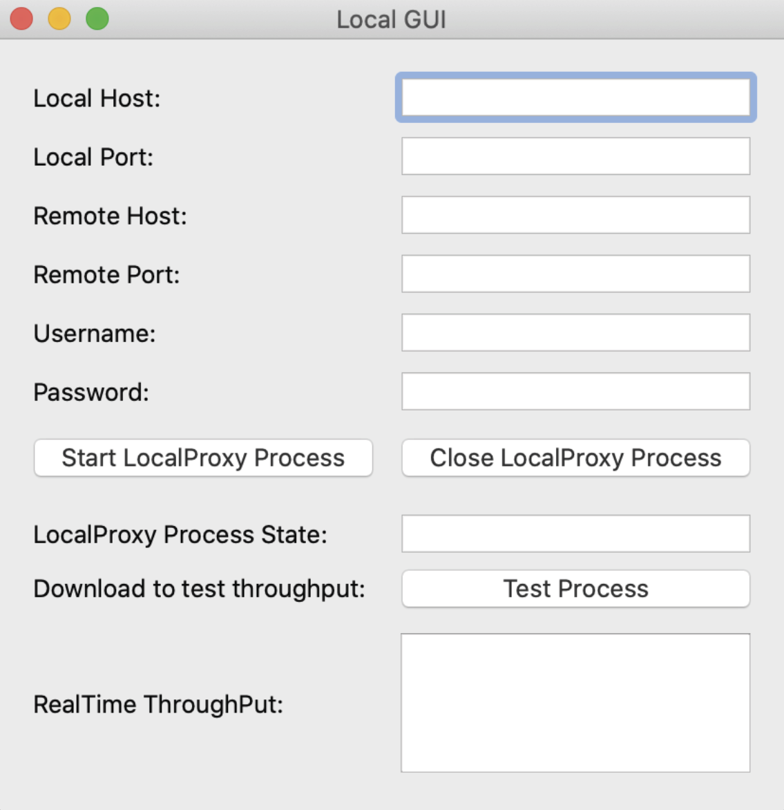

# Proxy-for-Socks5-and-HTTP-Tunnel
## 📕BUPT Course: Python Programming

a local proxy server that support SOCKS5 protocol and HTTP tunnel dual protocol, capable of communicate with the client (browser or LocalGUI) and the Remote module (Remote), and manages the local agent. The Remote system to manage the user provides a server to verify this request sent out from local, return the corresponding information, forward local requested URL/download contents to external servers, and return the information from the external server to local. Through the SANIC REST interface, CRUD(create, read, update, delete) can be implemented for users management and flow control.

---

## 🖼Runtime Screenshot

---

## ✉Contact Us

Feel free to open an issue if you have any questions about our project.
